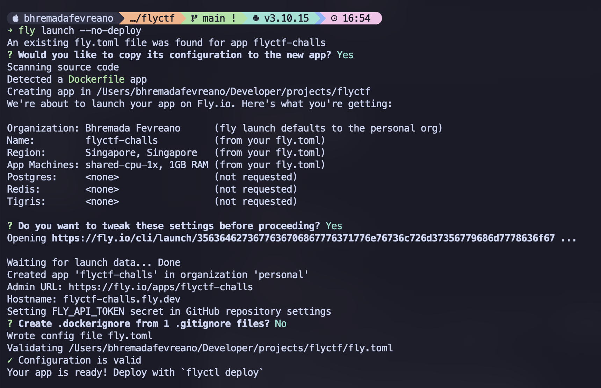

# FlyCTF

This repository contains a template for deploying CTF challenges on Fly.io, which provides a global network of servers and a simple CLI for deploying all kinds of applications easily at low cost.

> **⚠️ DISCLAIMER ⚠️**  
> FlyCTF is an experimental project still under development. It may contain bugs, security issues, or unexpected behavior. Use at your own risk in production environments. The authors are not responsible for any damage, data loss, or costs incurred by using this project.

## Benefits

-   **Low Cost**: Fly.io autostop machines when not in use (by default after 5 mins of idle), so you only pay for running machines.
-   **Docker Based**: Everything is based on Docker, even the main machine (Docker in Docker).
-   **SSL**: Free SSL certificates for your challenges out of the box.
-   **Easy to Use**: Fly.io has a simple CLI and web interface, so you can deploy and manage your challenges with just a few commands.
-   **Free Allowance**: You don't need to pay if your usage is under $5 per month and you can start for free.

## Cons

-   **Cold Start**: The first request to your challenge may take a few seconds to start up, as the machine needs to be started. But subsequent requests will be much faster.

## Getting Started

1. Create a Fly.io account
1. Install the Fly.io CLI: https://fly.io/docs/getting-started/installing-flyctl/
1. Login to your Fly.io account with `fly auth login`
1. Clone this repository
1. Run `fly launch --no-deploy` to create a new Fly.io app

    > Important: When prompted for "Do you want to tweak these settings before proceeding?", select "Yes", then clear the Internal Port field so that it's empty.

    

1. Run `fly volumes create data --size 10 --region sin` to create a new 10gb of persisted storage. This is used for persisting docker container data. You can change the size and region to your liking.
1. Run `fly ips allocate-v4 --shared && fly ips allocate-v6` to allocate IPv4 and IPv6 addresses for your app
1. To deploy, run `fly deploy` or `git push` if you have a git remote set up.
1. Finally open the challenge in your browser with `fly open` or visit the URL provided by Fly.io.

    At first, it will take couple of minutes to build and run the docker container. Check the logs with `fly logs` to see the progress. Once the container is built, you can start pwning your challenge.

## Deploying a new challenge

1. Create a new directory for your challenge inside the `challenges` directory
1. Build your challenge with `Dockerfile` and `docker-compose.yml`
1. In `docker-compose.yml`, make sure to expose the correct ports for your challenge. For example, if your challenge listens on port 80, you should have:

    ```yaml
    services:
        app:
            build: .
            expose:
                - '80'
    ```

1. Create `challenge.yml` file with the following structure:

    ```yaml
    internal_port: 80 # The port your challenge listens on
    public_port: 5001 # The port your challenge is exposed on, make sure don't use the same port as other challenges
    ```

1. Edit `fly.toml`, add these to open your challenge port to public:

    ```toml
    [[services]]
    http_checks = []
    tcp_checks = []
    script_checks = []
    protocol = 'tcp'
    internal_port = 5001 # based on public_port in challenge.yml
    auto_stop_machines = 'stop' # stop machines after 5 mins of idle
    auto_start_machines = true
    min_machines_running = 0

    [[services.ports]]
    port = 5001 # based on public_port in challenge.yml
    handlers = ['tls', 'http']
    ```

1. Deploy your new challenge with `fly deploy` or `git push` if you have a git remote set up.
1. You can always refer to the current `challenges` directory for examples of how to build your own challenges

## Monitoring

1. Run `fly logs` to view the logs of your app
1. Run `fly ssh console` to access the console of your app
